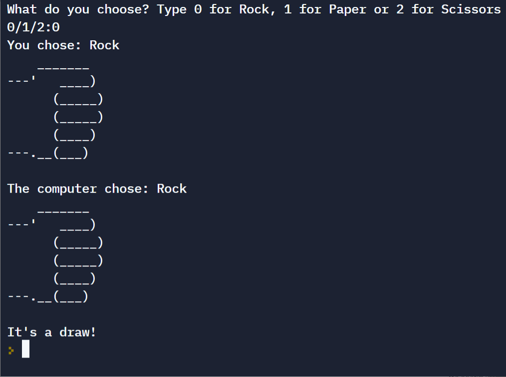

## Day 4: Randomisation and Python Lists

Concepts Practised

- Random Module
- Understanding the Offset and Appending Items to Lists
- Index Errors and Working with Nested Lists

### Project Day4: Rock - Paper - Scissors

