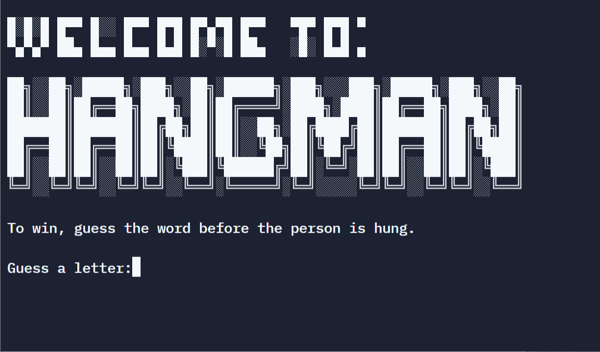

## Day 7: Hangman (Juego "El Ahorcado")

Concepts Practised

- How to break a Complex Problem down into a Flow Chart 
- How to Check the User's Answer 
- Improving the User Experience 
- How to Add ASCII Art and Improve the UI

### Project Day 7: Hangman

