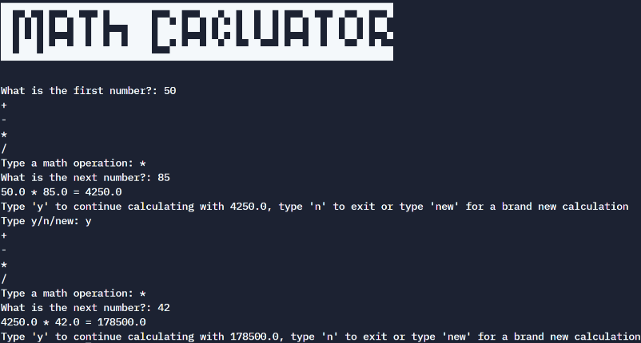

## Day 10 - Functions with Outputs

Concepts Practised

- Function with Outputs 
- Multiple return values 
- Docstrings 
- Combining Dictionaries and Functions 
- Print vs. Return 
- While Loops, Flags and Recursion

### Project Day 10: Calculator

