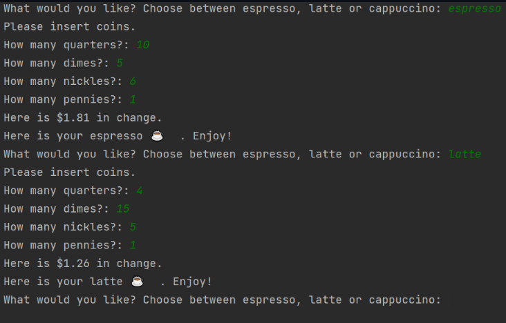

## Day 16 - Object Oriented Programming (OOP)

Concepts Practised

- Classes and Objects -
- Constructing Objects and Accessing their Attributes and Methods 
- How to Add Python Packages and use PyPi 
- Modifying Object Attributes and Calling Methods 
- OOP Coffee Machine

### Day 16 project: OOP Coffee Machine

